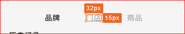
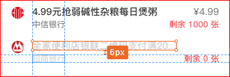

## 总
> **网页设计** 不是 静态的海报设计。 所以要考虑 动态扩展和配置化、多技术栈（运行环境）支持！

### 字和颜色
- 字体问题不谈（需要单独引入字体文件，用户手机定制主题字体问题在安卓机比较多）
- **子高** 问题不谈 （不同字体的子高不一样）

> 只谈 行高、行间距、字号（字体大小）
>
> 所以设计稿中尽量 行高、行间距、字号。（没有的话只能各开发自己评估，具体问刘燕丹和高姗姗）

- 字号越少越好维护和管理
- 颜色 同上
- 320（宽）设计图字号不小于12px。其他宽度最小字号=(yourWith/320)*12。 
> 320:12:17(行高)  &  375:14:20  & 640:24  &  750:28  

**备注**
> 以上字号和颜色 尽量少的建议 主要是针对 基础UI和业务组件UI。特殊活动页或者定制（节日）啥的想怎么花哨都行。只要你们开心就行。

### 图标
- 图标 按业务或者尺寸 分类都行。
- 通过工具生成雪碧图。
- 大量使用也可以 维护一份iconfont 图标库（设计维护）
> 基础公用的icon 尽量单色。

### 边界
- 设计图多考虑一下边界情况的展示。
> 没有结果展示、多（少）于设计个数、超出（少于）设计行数 等

- 具体 (eg：边界k；0=<k<n;n>=0)
> 0、没有等空的情况下。一般直接隐藏对应的容器(无需边界设计)！ 当然如果需要特殊的 填充提示语或者默认其他容器（box）则提供边界设计
- 比如：商品展示信息、补充信息等独立的容器展示区。没有可能直接不渲染。 比如：搜索 如果没有结果：可能需要 提供提示语的边界设计！（具体看产品要求）

> i<=k 时 默认都是 自左向右 或者 自上而下的 分布。当然 如果需要在 i(0<i<=k)时 有特殊展示 ，则提供边界设计（如果每一个i都是特殊设计，则依次提供边界设计）
- 这种 中间某一个特殊处理的比较少见。一般是 2i+1 统一变换颜色等 便于用户浏览 或者 根据后台配置 （比如京东自营、热卖等做个小标签）。直接 指定 i 像特殊设计的暂时没有见过。

> >k 时 超出边界时 ：提供边界设计(交互和控制逻辑体现出来)。不提供 k 边界的话，不知道产品要求是直接隐藏 还是 哪种方式 控制交互的 toggle。 
- 比如：搜索结果很多这种，经常需要显示加载更多等 提示语或者按钮去 做下一次的加载请求 （一次10条或者20条）。

### 容器（box）
- 每一个 dom元素都是一个个容器。整个页面就是容器的嵌套和组合！
- 建议设计 同事 了解一下box。能亲自写半天的box 更好！
> 比如一排三、四个 tap。应该当成四个容器去设计。而基本上看到的都是具体的tap内容宽高间距等信息。这样当实际数据是动态时：不是固定的字数，或者少于设计的tap数等。

**备注**
> 字和字的组合不是一个box(dom元素)。他们都需要放到一个box里面。

### UI
- ui分基础控件和业务组件。
> **基础控件** 应该是无关业务的。任何公司团队都可以使用，比如boostrap。这一类的通用UI控件在PC、特别是 CMS 后台管理平台是非常好用的（核心关注点在功能实现上）。而移动端很少有通用型的UI控件流行，公司层面不希望千篇一律、同时移动布局相对简洁。所以基础的通用UI控件目前主要针对公司内各团队使用，避免一个APP（公司）不同业务团队的产品五颜六色、重复开发等。
>
> 特殊 定制的 UI 控件可以 在项目中新增配置 文件覆盖（较多时、当然也可以更新到基础控件中去）或者项目代码中覆盖（较少时） 
> 
> **业务组件** 和产品需求相关。随着产品迭代周期变化；抽离出来是方便各页面共用时避免重复开发。

### 行高问题
- 文字行中经常出现标注的都是字高。ps设计图没有这个问题。主要是sketch 导出图。
- 单行好解决，直接不管设计图的子高标注。直接把list盒子的高度设置为行高（line-height）就自动居中了。控制一下字号就可以了。

### sketch
> 没有啥设计基础，谈一些业余的 使用技巧。基本都是针对前面提到过细节点，只是希望通过工具进行强制约束；毕竟规范这种事情靠个人自觉是很难约束和统一的。

- 总：尽量使用symbol 和 text-style (严格来说更 推荐 symbol)
>  统一 维护 项目中需要的 字号（行高一般相对应） 、颜色（10中、最多20中吧）。然后页面中使用的字号、颜色只能使用共用的symbol；需要单独使用特殊的 必须 经过讨论申请（一般不是完全独立的容器设计，不建议特殊化，多处使用可以添加到symbol中去共用）。

> 组件的设计 同样 设计成 symbol 共用。不容许自行在页面中特殊设计。（好的灵感和点子应该放在 优化symbol和独立的业务设计中去，而不是 在这些基础和共用的设计中搞特殊化） 

### 版本管理 （git）
> 版本管理在项目开发中是最最基础的工具。

- 记录项目中任何文件的每一次改动。可以随时回退到任何一次记录点上去。
- 多人协作中，可以确保自己编辑的永远是基于最新的。
- git：离线也可以正常工作。（cvs\svn没有本地的分布式库，需要在线更新同步）

**参考**
- https://git-scm.com/book/zh/v1/%E8%B5%B7%E6%AD%A5-%E5%85%B3%E4%BA%8E%E7%89%88%E6%9C%AC%E6%8E%A7%E5%88%B6

### [git-sketch-plugin](https://github.com/mathieudutour/git-sketch-plugin) 
> 插件安装就不提了。（看插件文档 或者问你们设计leader）

> 使用流程

## 参考
- dom元素（box）参考：https://developer.mozilla.org/zh-CN/docs/Web/HTML/Element
- box 参考：https://developer.mozilla.org/zh-CN/docs/Web/CSS/CSS_Box_Model/Introduction_to_the_CSS_box_model
