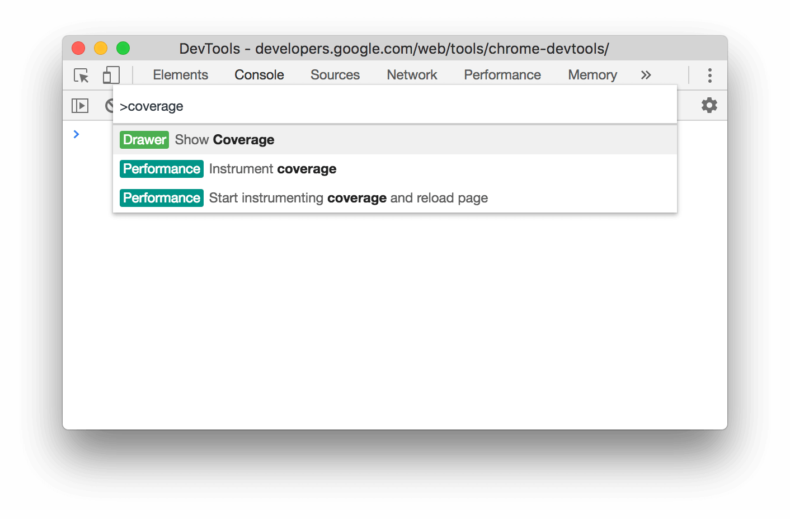
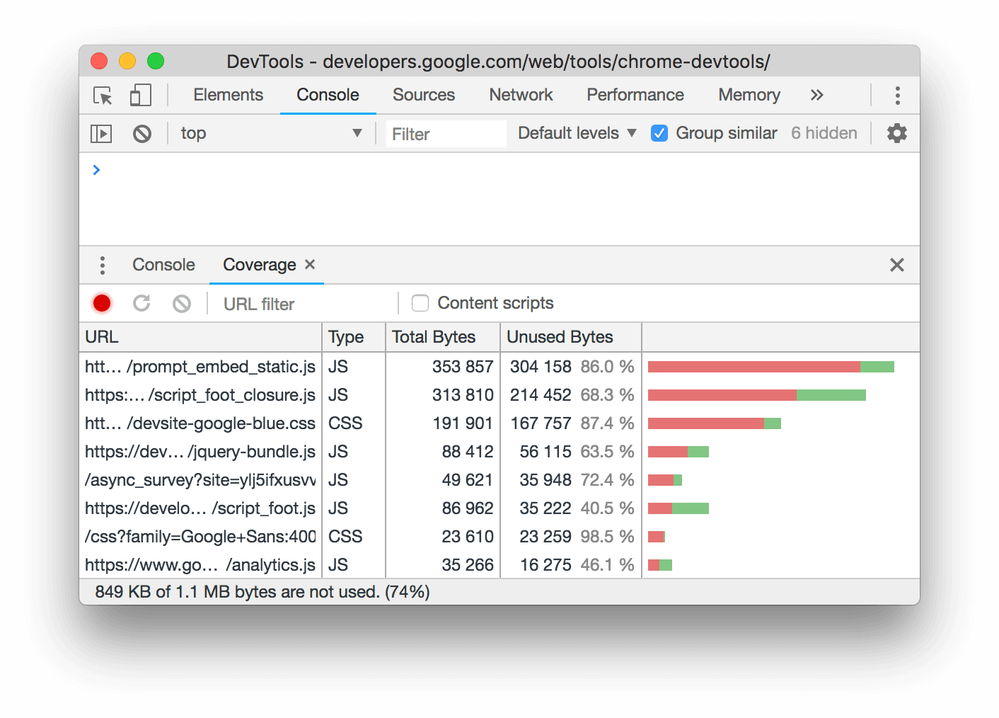
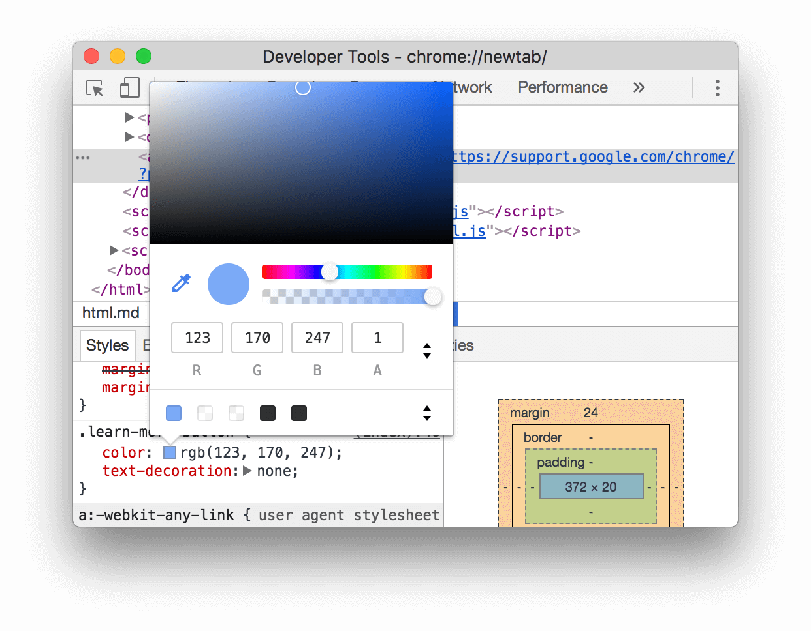

## chrome

### coverage
> Press Command+Shift+P (Mac) or Control+Shift+P (Windows, Linux, Chrome OS) while DevTools is in focus to open the Command Menu.

> 脚本文件的使用情况分析！

> 可以查看具体使用情况！

### color-picker
> 选择一个带颜色的dom(或者自己临时添加一个颜色 style).然后点击 css:rgb前面的 颜色框既可 调出颜色选择器功能！
